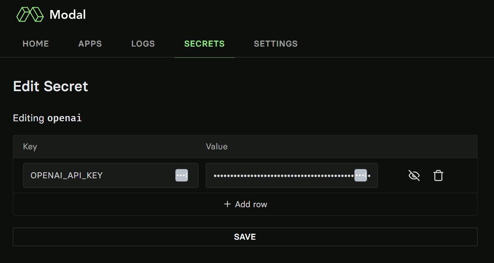

# AI-Marketing-Campaign-Generator

This repository contains an AI-powered marketing campaign generator. The application uses [OpenAI's GPT-3.5 model](https://platform.openai.com/docs/models) to generate creative marketing campaign suggestions based on user prompts. The backend is built using [FastAPI](https://fastapi.tiangolo.com/) and interacts with OpenAI's API, while the frontend is a [Streamlit](https://streamlit.io/) application that provides an interactive user interface. The applications are designed for containerized deployment using the [Modal](https://modal.com/) platform. Users simply input their brand name and a short description, and the system will generate a unique marketing campaign for them.

## Notes

This repository hosts a demo project for the "Desarrollo de Producto de Datos" course of the Data Science Master's program at Universidad del Desarrollo. The purpose of this project is to showcase the integration of various cutting-edge technologies including Modal, Streamlit, FastAPI, and OpenAI API.

The application is an AI-powered marketing campaign generator. It employs OpenAI's GPT-3 model to generate creative marketing campaign suggestions based on user inputs. The backend of the application is developed using FastAPI, a modern, fast (high-performance), web framework for building APIs with Python 3.6+ based on standard Python type hints. The frontend is a Streamlit application that provides a user-friendly interface for users to input their brand name and description and receive AI-generated marketing campaigns.

The entire application is containerized for deployment using the Modal platform, demonstrating an end-to-end data product development cycle, from AI model integration to user interface design and deployment.

This demo project serves as a practical example of building and deploying a data product as part of the course. It illustrates the application of the concepts and technologies taught in the program in a real-world scenario.

## Getting Started

Before you begin to run this project, there are a few prerequisites you will need to have in place:

- OpenAI API Key: In order to interact with OpenAI's API, you will need to have an API key. You can obtain this by creating an account on OpenAI's website and following their [instructions to generate an API key](https://help.openai.com/en/articles/4936850-where-do-i-find-my-secret-api-key).

- Modal Account: The application is containerized for deployment using the Modal platform. Visit the [Modal](https://modal.com/signup) website to sign up for an account if you don't have one already.

- Streamlit Account (Optional): While you can run Streamlit apps locally without an account, having a Streamlit account allows you to deploy and share your apps, which can be useful for demonstrating your project to others. If you wish to use this feature, [sign up for a Streamlit account](https://share.streamlit.io/signup).

## Installation

```
conda create --name ai-marketing-campaign-generator -c conda-forge python=3.10
conda activate ai-marketing-campaign-generator
pip install -r requirements.txt
```


## [SERVER] Modal deployment

Getting started
The nicest thing about all of this is that you don’t have to set up any infrastructure. Just:

- Create an account at modal.com
- Install the modal-client package
- Set up a token using `modal token new`
- Create a Secret `openai` to add your OpenAI API Key `OPENAI_API_KEY` to your Secrets dictionary using the [modal dashboard](https://modal.com/secrets).



…and you can start running jobs right away.

```
cd backend
modal serve fastapi_app.py
```

To deploy this as a permanent app, run the command

```
modal deploy fastapi_app.py
```

## [CLIENT] Streamlit app

```
streamlit run st_app.py
```

